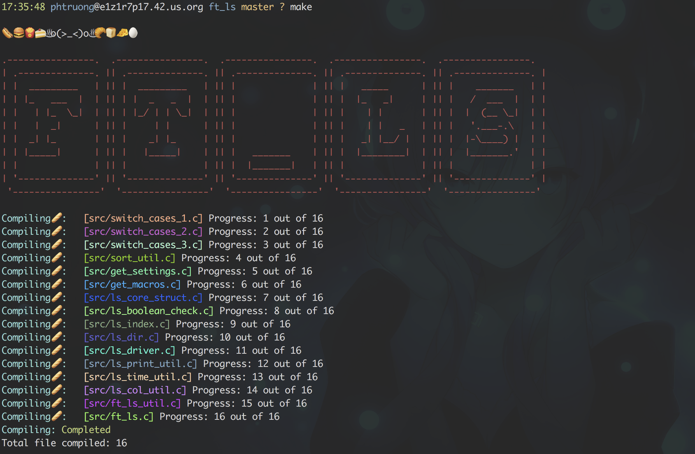
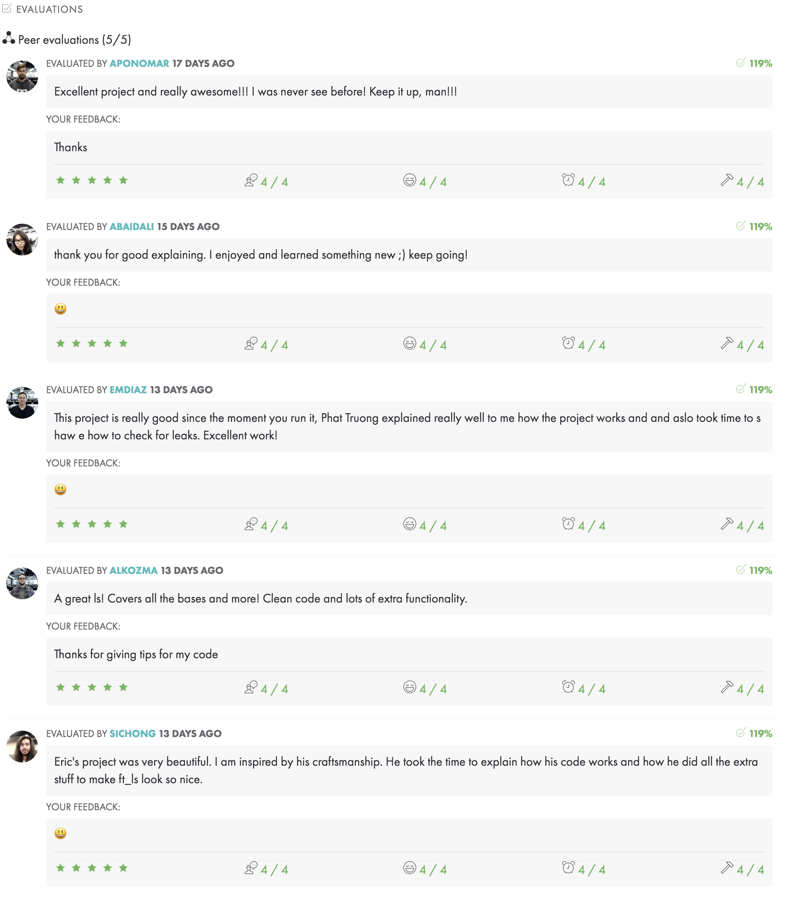

# ft_ls
Recoding the ls command\
Only tested on school machine:\
macOS High Sierra\
Version 10.13.4 (17E199)\
Make version: GNU Make 3.81\
Tested with zsh

## Flags covered

List:
  1. A
     * List all directories except . and ..
  2. I
     * Custom flag, sort by alpha but case insensitive, turns on -a
  3. F
     * Displays a corresponsding char to a file type. '/' for Dir, '\*' for executatble, '@' for symlink
     * Does not cover socket, FIFO nor whiteout.
  4. R
     * Recursively list subdirectories encountered
  5. S
     * Sort files by size
  6. a
     * Include directory entries with names starting with '.'
  7. i
     * Display inodes (file's file serial number)
  8. l
     * List files in long format, total sum for all file sizes is output before listing
  9. m
     * List files across page, separated by commas
  10. n
      * Display user and group IDs numerically
  11. p
      * Write a '/' after each filename that is a directory
  12. r
      * Reverse order of sorting
  13. t
      * Sort by time modified (most recent comes first)
  14. x
      * Multi-column is sorted horizontally rather than vertical
  15. 1
      * One entry per line

see [pdf](https://github.com/nkone/ft_ls/blob/master/ft_ls.en.pdf) for more details
### Demo:

#### Score:

